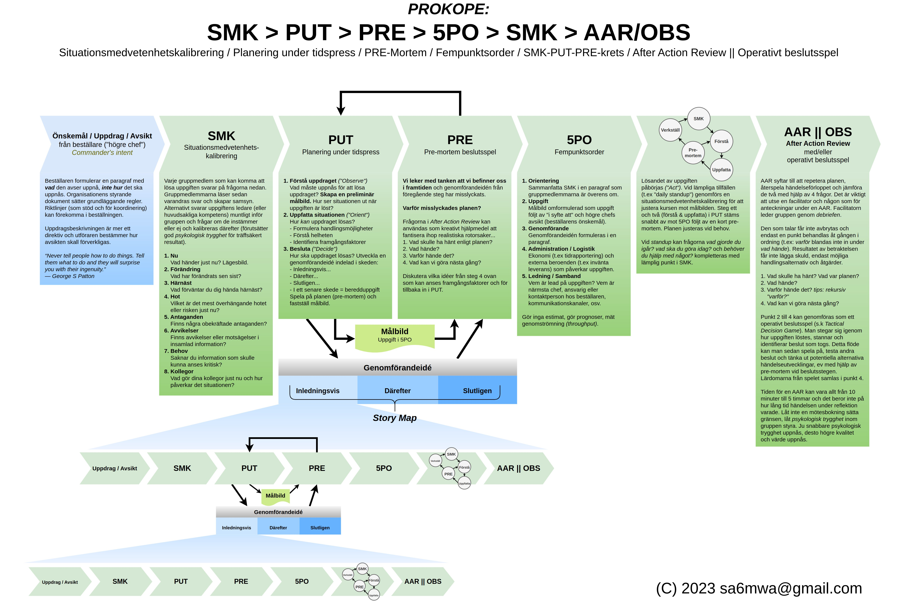
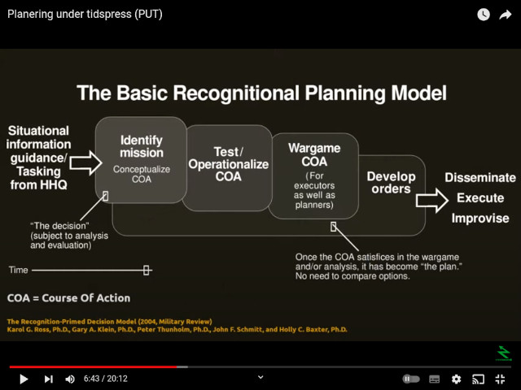

# Uppdragsteknik

*Uppdragsteknik* is a play on the Swedish word for *mission-based
tactics* (Mission Command) - *uppdragstaktik* - invented and
implemented by the Prussian Army 200 years ago and later - after the
reforms and further development by Helmuth von Moltke - called
Auftragstaktik (Führen mit Auftrag).

## Orientation

I work as a software engineer and/or solutions architect with a keen
interest in the military leadership philosophy called Auftragstaktik
or Uppdragstaktik as it is called here in Sweden. In the US it is
called Mission Command, but there are many differences from the
original doctrine. I have a military background as a radio operator
(and a short period as a group/squad leader) at both company and
battalion C2 levels where I have come in contact with many aspects of
how operational orders, planning, wargaming and retrospectives (After
Action Reviews) are conducted by senior officers.

My bookshelf contains about a dozen books specifically about
Auftragstaktik or related topics with titles as Adopting Mission
Command by Vandergriff, Moltke on The Art Of War by Hughes,
Auftragstaktik by Oliviero, On War by Clausewitz (translated by
Jolles), Raising The Bar by Vandergriff, Auftragstaktik by Jochen
Wittmann, Truppenführung by Beck (with Fritsch and Stulpnaegel), John
Boyd by Coram, and Certain To Win by Chet Richards.

## Prokope

Based on German sources on Auftragstaktik, Swedish Uppdragstaktik,
John Boyd's [Patterns of Conflict](http://www.projectwhitehorse.com/pdfs/boyd/patterns%20of%20conflict.pdf),
and the research by Gary Klein et al on naturalistic decision-making
with inspiration from Peter Senge's learning organization described in
[The Fifth Discipline](https://en.wikipedia.org/wiki/The_Fifth_Discipline), I
have developed a guide or tool (not a process, at least not rigid)
named *Prokope* (progress in Greek) illustrated below (currently only
in Swedish). It has similarities to and is compatible with eXtreme
Programming specifically (by Kent Beck) and Scrum (mainly by Jeff
Sutherland), but includes Klein & Schmitt's Recognitional Planning
Model (or Planering Under Tidspress by Peter Thunholm), The Five
Paragraph Order, Klein's Situational Awareness Calibration assessment,
Pre-Mortem, and the military way of conducting a retrospective, albeit
a shorter version, called the After Action Review.

The "mission" can be a single task or a sprint, the method is the
same, but with less effort and less planning time for tasks and more
time-consuming for sprints, quartely planning, etc for obvious
reasons. The idea is to learn in every iteration, meaning there is an
After Action Review after every User Story or even task, not just
after a two week sprint for example. The smallest team to use the
method is a pair, two people, the philosophy is that there are to be
no explicit individual work. Pair-programming or frequent dialogue
and check-ins daily about your work is implicit for this method or the
situational awareness assessment and After Action Review is not fully
useful.

Download [Prokope SVG](prokope.svg).

## PUT/RPM

The following video is in swedish from my podcast
[QZJ](https://open.spotify.com/show/50gMmT5X99LS8MfOv2VHXK) and
broadly describes *Planering Under Tidspress* which is the Swedish
Army implementation of Gary Klein & John Schmitt's Recognitional
Planning Model by Peter Thunholm. The planning model is the base of
*Prokope*.

## The military stereotype

In the introduction to the English translation of Truppenführung by Beck,
Fritsch, and Stulpnaegel titled *On the German Art of War* the editors Bruce
Condell and David T Zabecki writes...

> To a certain degree, there is a level of validity to many of the
> commonly believed characteristics of the German society and
> character. These include an almost unquestioning acceptance of
> authority, social rigidity, and an intense preoccupation with record
> keeping, paperwork and all forms of bureaucractic procedure. Nowhere
> are these characteristics so prominent as in the German civil
> service. And while the U.S. Army tends to reproduce faithfully most
> of the worst features of the U.S. civil service, the German Army was
> remarkably free of such afflictions.
> ...
> One of the most important concepts of the post-World War I German
> military system was that of Auftragstaktik. The term can be
> translated loosely to "mission-type order," but there is no real
> English equivalent that adequately conveys the full
> meaning. Auftragstaktik is based on the principle that a commander
> should tell his subordinates what to do and when to do it, but not
> necessarily tell them how to do it. In accomplishing their missions,
> subordinate commanders are given a wide degree of latitude and are
> expected to exercise great initiative.
> ...
> Prior to World War I, the German Army operated under a principle
> known as *Weisungsführung* (leadership by directive), which was
> similar to Auftragstaktik, but only entrusted commanders down to the
> army level - or sometimes the corps - with broad discretionary
> powers in the execution of their missions. Auftragstaktik, which was
> a post-World War I creation of *Das FuG* (by Seeckt) and carried
> forward into *Truppenführung*, extended that principle down to the
> lowest squad leader and even, when necessary, to the individual
> soldier. Writing in his 1925 Observations of the Chief of the Army
> Command, von Seeckt noted:
>
> *The principal thing now is to increase the responsibilities of the
> individual man, particularly his independence of action, and thereby
> to increase the efficiency of the entire army ... The limitations
> imposed by exterior circumstances causes us to give the mind more
> freedom of activity, with the profitable result of increasing the
> ability of the individual.*
>
> For Auftragstaktik to work, a subordinate leader or even a common
> soldier given a mission must fully understand his commander's
> intent - and in most cases, the intent of the next higher
> commander. This, of course, implies that the subordinate leader must
> understand "why." If he doesn't understand, he has the obligation to
> ask. Conversely, the superiod leader issuing the order has the
> obligation to explain. Such a process does not fit the popular
> stereotype of military organizations in general, nor especially is
> it characteristic of German society. Thus we find in Truppenführung
> passages that would still be considered radical in many of the
> world's armies today...

On the back-cover of Jochen Wittmann's Auftragstaktik (ISBN
978-3-937885-58-2) Christian E.O Millotat, maj general (retired) of
the Germany Army writes:

> ... Many allied armed forces have tried to introduce Auftragstaktik
> based on the German experience and adopted it to their specific
> military cultures. Misinterpretation and misunderstanding, however,
> very often accompanied this attempt and process, and the intent to
> use Auftragstaktik very often degenerated to a lip
> service. Lieutenant Colonel Wittmann identifies a broad variety of
> definitions of Auftragstaktik in his literature analysis. Since
> Auftragstaktik lacks from theoretical foundation, he tries to ground
> it theoretically in an interesting and convincing manner. His work
> has, undoubtedly, extraordinary relevance to the present and future
> dimensions of leadership in the mulinational structured armed forces
> of today, but also in areas outside of the military sphere.

I think it is very relevany outside the military sphere. On page 48 in
Auftragstaktik, Wittmann has drawing comparing "befehlstaktik"
(command guidance or command control) and Auftragstaktik where the
characteristics of Befehlstaktik include *details of order*, very
little learning effect, low trust, little self-initiative, little
freedom of action, top-down-orientation, low flexibility (rigidity
rather than agility), etc, while Auftragsktik push on the following
characteristics:

* Decentralization
* Delegation
* Freedom of action
* High cost-benefit ratio
* Bottom-up-orientation
* High learning effect
* Trust
* Self-initiative
* Self-regulation
* Flexibility
* Intrinsic responsibility
* Creativity / improvisation
* Speed of decision-making
* Low details of orders
